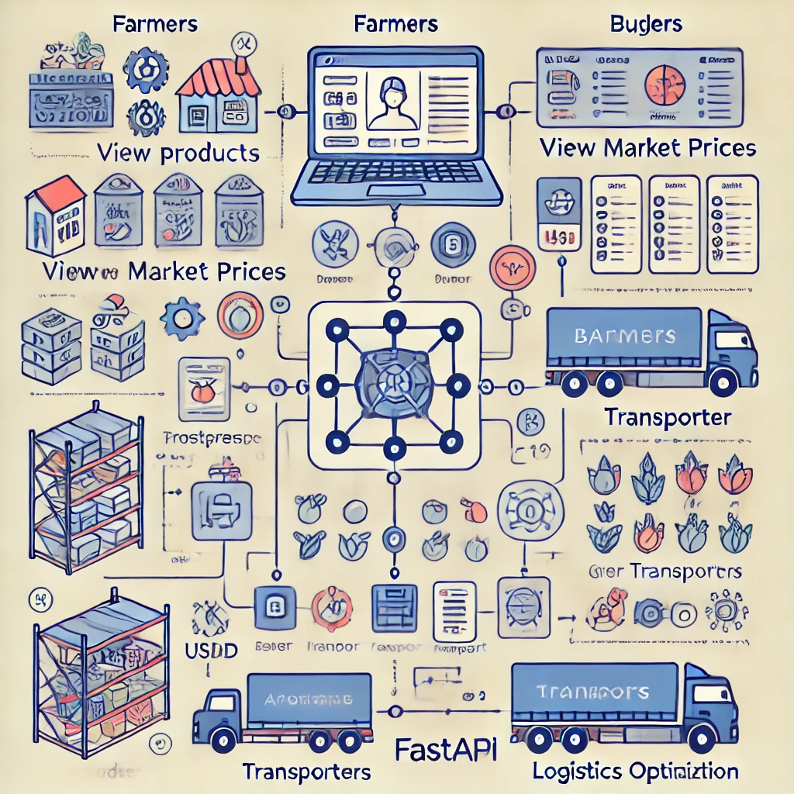

# AI_Powered_Agricultural_Market_-_Supply_Chain_Optimizer
AI-Powered Agricultural Market &amp; Supply Chain Optimizer

Pitch Deck: https://www.canva.com/design/DAGeXT4ZyoI/OlhrgZk3g0TzxbeeCzLC5A/edit?utm_content=DAGeXT4ZyoI&utm_campaign=designshare&utm_medium=link2&utm_source=sharebutton

Structure:

AI-Agriculture-Marketplace/
├── frontend/               # React Web Application
│   ├── public/
│   ├── src/
│   │   ├── components/      # Reusable UI Components
│   │   ├── pages/           # Page Components (Home, Dashboard, etc.)
│   │   ├── services/        # API Calls to Backend
│   │   ├── context/         # State Management
│   │   ├── hooks/           # Custom Hooks
│   │   ├── assets/          # Images, Icons
│   │   ├── App.js
│   │   ├── index.js
│   │   ├── routes.js
│   ├── package.json
│   ├── .env
│   ├── README.md
│   └── webpack.config.js

├── mobile/                 # React Native Mobile App
│   ├── src/
│   │   ├── components/
│   │   ├── screens/
│   │   ├── navigation/
│   │   ├── services/
│   │   ├── assets/
│   │   ├── App.js
│   ├── android/
│   ├── ios/
│   ├── package.json
│   ├── .env
│   ├── README.md

├── ussd/                   # USSD Integration for farmers
│   ├── handlers/           # Logic for handling USSD requests
│   ├── services/           # Business logic for USSD processing
│   ├── index.js            # Entry point for USSD service
│   ├── package.json
│   ├── .env
│   ├── README.md

├── backend/                # Node.js Backend
│   ├── config/
│   │   ├── db.js           # Database connection (PostgreSQL, MongoDB, MYSQL) #We shall use MYSQL
│   │   ├── cloud.js        # Cloud Storage Config (for images)
│   ├── models/             # Database Models (User, Product, Order)
│   ├── controllers/        # Business Logic for Routes
│   ├── routes/             # API Routes (Auth, Products, Orders)
│   ├── middleware/         # JWT Authentication, Error Handling
│   ├── utils/              # Utility functions (helpers, validators)
│   ├── server.js           # Express App Entry Point
│   ├── package.json
│   ├── .env
│   ├── README.md

├── ai-service/             # FastAPI AI Model Integration
│   ├── models/             # Machine Learning Models for price prediction
│   ├── services/           # Data Processing & Analysis
│   ├── api.py              # FastAPI Endpoint
│   ├── requirements.txt
│   ├── .env
│   ├── README.md

├── docs/                   # Documentation
│   ├── API_Documentation.md
│   ├── Architecture_Diagram.png
│   ├── Setup_Guide.md

└── README.md               # Project Overview

Roadmap of our Application

Phase 1: Research & Planning
✅ Define user personas (farmers, buyers, transporters, admin).
✅ Conduct market research on agricultural pricing & logistics challenges.
✅ Finalize tech stack (React, React Native, Node.js, FastAPI, MySQL).
✅ Design database schema for users, products, orders, and logistics.
✅ Set up development environment (GitHub, CI/CD, APIs, MySQL database).

🔧 Phase 2: Backend & AI Development
✅ Implement User Authentication (JWT-based registration & login).
✅ Set up MySQL (structured data storage).
✅ Build Product Management APIs (add, update, delete listings).
✅ Develop Order Processing APIs (buyers purchase from farmers).
✅ Integrate AI Price Prediction Service (FastAPI, ML model).

🎨 Phase 3: Frontend & Mobile App (We can put this phase on hold if needed)
✅ Develop React Web App (farmer & buyer dashboard).
✅ Implement React Native Mobile App (USSD integration for farmers).
✅ Integrate frontend with backend APIs.

📦 Phase 4: Logistics & Optimization
✅ Implement Transporter Matching System (AI-powered logistics).
✅ Optimize routes & match farmers with best buyers.

⚡ Phase 5: Testing & Deployment
✅ Perform unit & integration testing (backend, frontend, AI models).
✅ Deploy backend on cloud (AWS/GCP).
✅ Deploy frontend & mobile apps (Web + Google Play Store).
✅ Run beta testing with farmers & buyers.

🎯 Phase 6: Scaling & Partnerships
✅ Onboard initial farmers & buyers.
✅ Partner with cooperatives, agribusinesses, and logistics firms.
✅ Optimize AI models with real-time data.